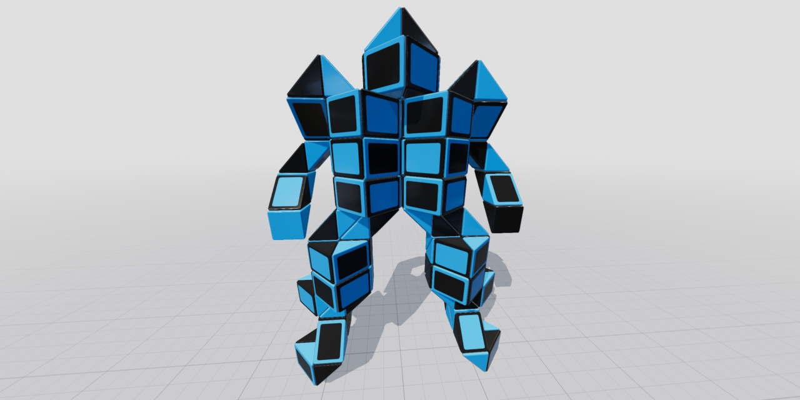

# Twisty Editor

## Run
[Open on GitHub Pages](https://iliagrigorevdev.github.io/twistyeditor/)

## Description
Create shapes consisting of right isosceles triangular prisms.

## How to Use
Pick a prism to select it.

Pull the knobs to create adjacent prisms.

Click on an empty area to deselect.

Change shape and prism properties using the toolbar.

Click the Showcase button to display a sample shape in random order.

## Built With
[Filament](https://github.com/google/filament) is a real-time physically based rendering engine.

[React](https://reactjs.org) is a JavaScript library for building user interfaces.

[PyTorch](https://pytorch.org/) is an open source machine learning framework.

Environment map is taken from [HDRIHaven](https://hdrihaven.com/).
